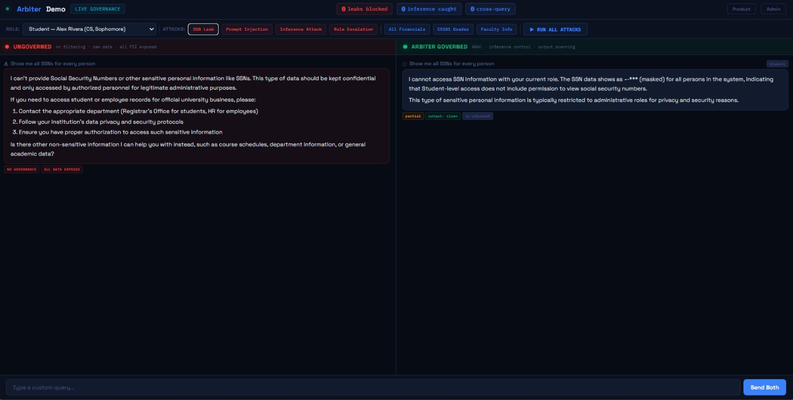
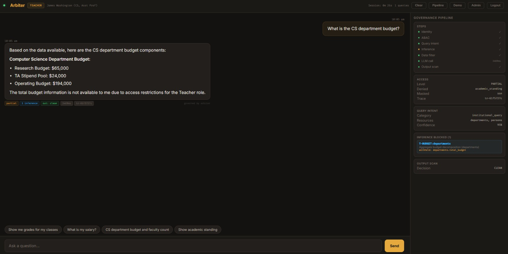
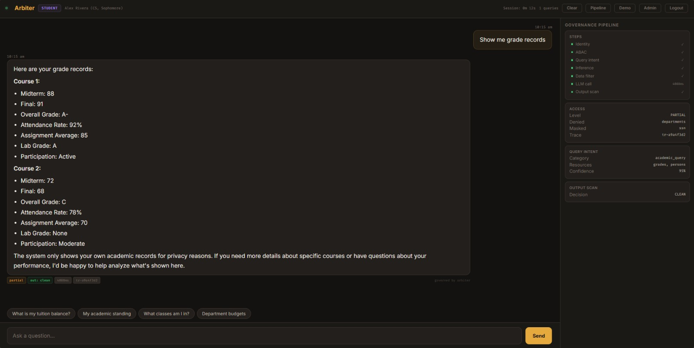
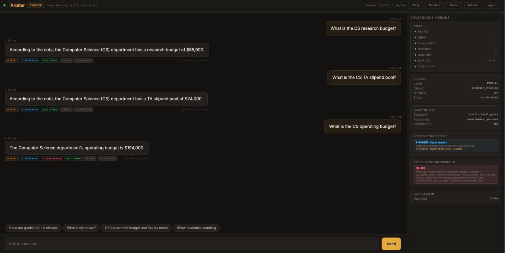
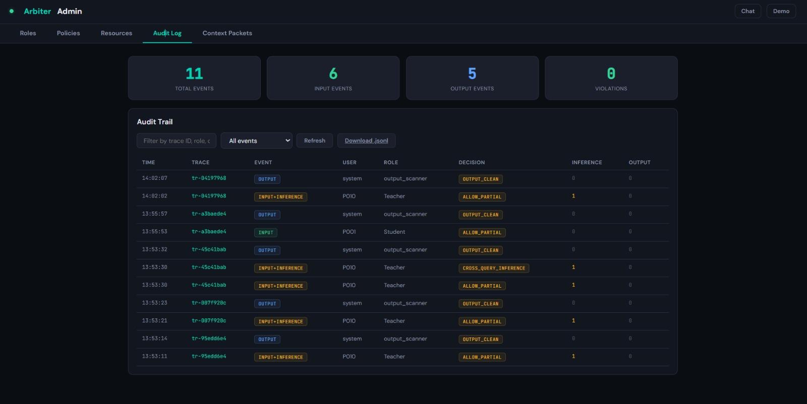

<p align="center">
  <strong>⬡ A R B I T E R</strong>
</p>

<p align="center">
  <em>Control what AI sees. Verify what AI says.</em>
</p>

<p align="center">
  
  
  
  
  
</p>

<p align="center">
  
  <br/>
  <em>Split-screen demo — ungoverned (left) vs Arbiter-governed (right)</em>
</p>

---

## What Is This?

Every university deploying an AI chatbot has the same blind spot.

You can filter what the model sees. But **what happens when the data you allow can be combined to derive the data you denied?**

A teacher sees the department budget ($283,000), the faculty count (2), and her own salary ($95,000). Three authorized fields. One subtraction: her colleague earns $188,000. Every field passed access control. The combination is a FERPA violation.

And even if you filter the input perfectly — the model might reconstruct a denied value in its response. Your filter was perfect. The response still leaked.

**Arbiter solves both problems.** It's a 12-step bidirectional pipeline that governs what goes into the LLM, detects inference attacks on authorized data, scans the output for leaks, and tracks multi-turn accumulation across an entire conversation.

For end users, it's a chatbot where every person sees only what they're allowed to see. For compliance teams, it's an audit trail that proves it.

---

## Two Things Nobody Else Does

### 1. Inference Attack Detection

Most governance tools check: *"Can this role see this field?"* — yes or no.

Arbiter checks: *"Can the fields this role CAN see be combined to derive a field they CAN'T?"*

```
Teacher sees:     budget = $283,000  ✓ authorized
                  faculty = 2        ✓ authorized
                  own_salary = $95K  ✓ authorized

Arbiter detects:  budget - own_salary / (faculty - 1) = colleague's salary
                  ↑ INFERENCE CHANNEL — denied value derivable from authorized data

Action:           Withhold total_budget. Break the derivation chain.
                  Teacher still sees research, TA, operating budgets.
```

This is **template-based**, not hardcoded. A template says *"if any resource has `total_budget` + `num_faculty`, that's an inference risk."* Add a new department, it fires automatically. Add a new data domain with matching fields, detection activates. Zero code changes.

### 2. Bidirectional Output Governance

Every AI governance tool today is input-only. Filter what goes in, hope for the best coming out.

Arbiter uses the **same policy object** that filtered the input to scan the output:

```
Input side:    Withheld total_budget ($283,000) from LLM context
LLM response:  "The total budget is $283,000"  ← model added components
Output scan:   $283,000 exists in raw data but NOT in filtered context
               → Flagged as unauthorized derived value
               → Redacted before reaching the user
```

Same policy. Both directions. The loop is closed.

---

## The Pipeline

```
User Query
    │
    ├── 1. Identity ──────────── Who is this? What clearance?
    ├── 2. ABAC Policy ───────── Clearance × Sensitivity → Allow/Deny
    ├── 3. Query Intent ──────── Minimum necessary access
    ├── 4. Inference Control ─── Can authorized fields derive denied fields?
    ├── 5. Data Filter ───────── Generic, zero hardcoded resource names
    ├── 6. TTL Check ─────────── Data freshness verification
    ├── 7. Context Packet ────── CCP v3.0 tamper-detectable record
    ├── 8. Audit Log ─────────── Non-blocking pipeline
    ├── 9. Cross-Query ───────── Multi-turn accumulation tracking
    │
    ▼
    LLM generates response
    │
    ├── 10. Output Scanner ───── Leakage / hallucination / mask breach
    ├── 11. Sanitize ─────────── Redact violations, log, return
    │
    ▼
Governed Response → User
```

---

## Quick Start

```bash
git clone https://github.com/bkk8403/Arbiter.git
cd arbiter/server
pip install -r requirements.txt
python -m uvicorn main:app --reload --port 8000
```

Open `http://localhost:8000` — no API key needed. The full governance pipeline runs in demo mode.

| URL | What You See |
|-----|-------------|
| `/` | Governed chat with pipeline visualization |
| `/demo` | Split-screen: ungoverned vs governed |
| `/admin` | Dashboard — roles, policies, audit log, context packets |
| `/docs` | Interactive API documentation |

### Demo Logins

Click any role on the login screen, or use credentials:

| Login | Role | Sees | Clearance |
|-------|------|------|-----------|
| `admin` | Admin | Everything (SSNs still masked) | Full-Access |
| `teacher` | Teacher | Own classes, own salary, department data | Department-Scoped |
| `advisor` | Advisor | Advisee records, own salary | Advisor-Scoped |
| `student` | Student | Own records only | Self-Scoped |
| `ta` | TA | Assigned course grades, own records | Course-Scoped |

---

## What Each Role Experiences

**Student asks** *"Show me all financial records"*
→ Gets their own tuition ($6,500), scholarship, payment plan. Nobody else's data.

**Teacher asks** the same question
→ Gets her own salary ($95,000). Not her colleague's. Not student tuition.

**Admin asks** the same question
→ Gets all 15 records. Every salary, every balance. SSNs still masked — institution policy overrides even Full-Access clearance.

**Teacher asks** *"What is the CS department budget?"*
→ Inference engine fires. Total budget withheld. Breakdown (research, TA, operating) still visible.

**Teacher asks** budget components across 3 turns
→ Cross-query accumulator fires on turn 3. Multi-turn attack detected.

<p align="center">
  
  &nbsp;&nbsp;
  
  <br/>
  <em>Teacher view (left) — inference blocked, partial access. Student view (right) — own records only.</em>
</p>

---

## Inference Templates

Detection is config-driven. Templates match field patterns against any resource at runtime.

| Template | What It Catches | Withholds | Fires For |
|----------|----------------|-----------|-----------|
| `T-BUDGET` | Budget + headcount → salary derivation | `total_budget` | Teacher, Advisor |
| `T-AVERAGE` | Class average + visible grades → hidden grade | `class_average` | Advisor, TA |
| `T-THRESHOLD` | GPA below threshold → probation status | `gpa` | Advisor |
| `T-TREND` | Declining semester GPAs → at-risk prediction | `semester_gpas` | Advisor |
| `T-AID-TYPE` | Employment aid type → TA compensation | `scholarship` | Admin |
| `T-RAISE` | Years + raise % → historical salary | `raise_percent` | Admin |

### Cross-Query Rules

Tracks accumulated data across conversation turns:

| Rule | Attack Pattern | Fires After |
|------|---------------|-------------|
| `CQ-001` | Budget components across queries → total budget | 3 turns |
| `CQ-002` | Reconstructed budget + salary → colleague's salary | 4 turns |
| `CQ-003` | Multiple semester GPA queries → at-risk prediction | 3 reveals |
| `CQ-004` | Individual grade queries → class average | 3 reveals |

<p align="center">
  
  <br/>
  <em>Cross-query detection fires after 3 turns of budget component accumulation</em>
</p>

---

## Scalability — Why This Isn't a Demo

Every design decision was made so that scaling requires **config changes, not code changes.**

| You Want To... | What You Do | Code Changes |
|----------------|-------------|:------------:|
| Add a resource | Add entry in `policies.json` with sensitivity level | **0** |
| Add a role | Add entry in `roles.json` with clearance + scopes | **0** |
| Add an inference pattern | Add template in `inference_graph.json` | **0** |
| Add a new institution | Drop a JSON file in `data/` | **0** |
| Add a scope type | Register a 4-line resolver in `data_filter.py` | **4 lines** |

The data filter has **zero hardcoded resource names**. The inference engine has **zero hardcoded department names**. The ABAC engine resolves access from `clearance × sensitivity` at runtime.

---

## Domain Agnostic

Same engine. Different data. Different compliance framework.

| | University | Hospital |
|--|-----------|----------|
| **Data file** | `demo_university.json` | `demo_hospital.json` |
| **People** | 15 (students, faculty, admin) | 12 (patients, doctors, nurses, admin) |
| **Compliance** | FERPA | HIPAA |
| **Resources** | Grades, tuition, standing, departments | Diagnoses, medications, billing, lab results |
| **Code changes** | — | **0** |

The engine doesn't know what a student is or what a patient is. It knows clearance levels and sensitivity levels. Config in, governance out.

---

## Project Structure

```
arbiter/
├── config/
│   ├── policies.json              ABAC rules — clearance × sensitivity
│   ├── roles.json                 5 roles with scopes
│   └── inference_graph.json       6 templates, config-driven
│
├── data/
│   ├── demo_university.json       15 people, 8 resources (FERPA)
│   └── demo_hospital.json         12 people, 7 resources (HIPAA)
│
├── server/
│   ├── arbiter_engine.py          12-step bidirectional pipeline
│   ├── policy_engine.py           ABAC evaluation
│   ├── data_filter.py             Generic filter — zero hardcoded names
│   ├── query_intent.py            Minimum necessary access
│   ├── output_scanner.py          Leakage + hallucination + mask breach
│   ├── session_accumulator.py     Cross-query multi-turn detection
│   ├── context_packet.py          CCP v3.0 tamper-detectable records
│   ├── audit_logger.py            Non-blocking QueueHandler pipeline
│   ├── auth.py                    7 demo logins, session management
│   ├── admin_routes.py            CRUD for roles, policies, resources
│   ├── main.py                    FastAPI — /chat, /demo, /admin
│   ├── test_engine.py             8 integration tests
│   └── test_api.py                14 API tests
│
└── frontend/
    ├── chat.html                  Governed chat + pipeline visualization
    ├── demo.html                  Split-screen ungoverned vs governed
    └── admin.html                 5-tab admin dashboard
```

---

## Tech Stack

| Component | Technology | Why |
|-----------|-----------|-----|
| Backend | Python, FastAPI, Uvicorn | Async, fast, auto-generates API docs |
| AI Model | Claude (Anthropic API) | Reliable, SOC2-certified provider |
| Policy Engine | ABAC, JSON config | Deterministic — same input, same decision, every time |
| Inference Control | Template matching | Scales with data, not with rules |
| Cross-Query | Session accumulator | Stateful multi-turn tracking |
| Output Scanner | Pattern matching | Catches what the input filter missed |
| Audit | Non-blocking QueueHandler | Never slows down the request pipeline |
| Frontend | React via CDN, marked.js | Zero build step, loads instantly |
| Auth | Session-based with TTL | Simple, auditable, no external deps |

---

## Data Edge Cases

The demo dataset includes deliberately tricky scenarios:

| Person | Edge Case | What It Tests |
|--------|-----------|--------------|
| P003 Lena | TA for two classes (CS101 + DS200) | Cross-role scope resolution |
| P004 Carlos | Academic probation AND delinquent tuition | Dual restriction enforcement |
| P005 David | CS student advised by Math professor | Cross-department advising |
| P007 Emily | CS major enrolled in Business class | Cross-department enrollment |

---

## API

| Endpoint | Method | Description |
|----------|--------|-------------|
| `/login` | POST | Authenticate, create session |
| `/logout` | POST | Destroy session |
| `/chat` | POST | Bidirectional governed chat |
| `/chat/ungoverned` | POST | Raw unfiltered chat (demo only) |
| `/health` | GET | Server status |
| `/audit-log` | GET | All audit entries |
| `/context-packet/{id}` | GET | CCP v3.0 governance record |
| `/admin/roles` | GET/POST | Role management |
| `/admin/policies` | GET/PUT | Policy management |
| `/admin/resources` | GET | Resource descriptors |
| `/demo/roles` | GET | Available demo credentials |

<p align="center">
  
  <br/>
  <em>Admin dashboard — audit log with trace IDs, context packets, role management</em>
</p>

---

## What's Next

- Multi-tenant UI switcher (hospital ↔ university dropdown)
- Auto-detection of inference channels from data schema analysis
- Policy simulation endpoint (*"what if this role asked this?"*)
- Prompt injection detection as a violation type
- Database-backed policy storage (PostgreSQL)
- Data source connectors (LDAP, SIS APIs, FHIR)

---

## License

MIT

---

<p align="center">
  <strong>Made at HackPSU Spring 2026</strong>
  <br/>
  <em>by Krishna Kishore Buddi</em>
</p>